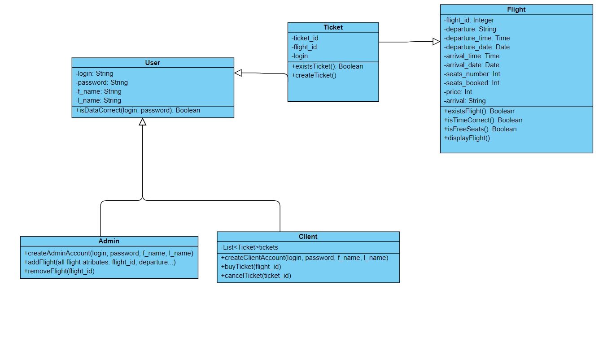
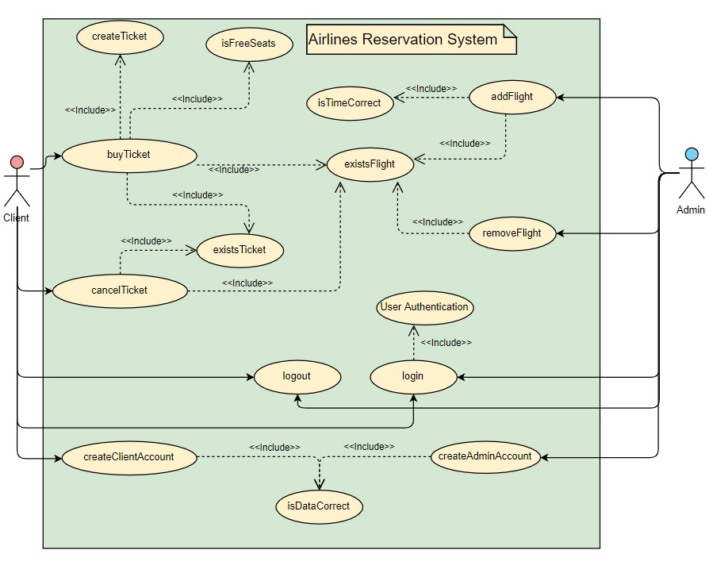
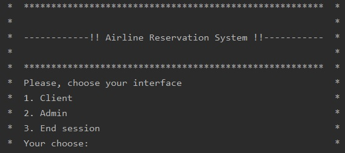

# Airline Reservation System

Console application for booking airline tickets. Created as a final project for a Software Engineering course using the TDD process.

# Technologies and libraries
- Java 11
- [JUnit](https://junit.org/junit5/) used for unit tests (5.4.2 version)

# Diagrams

**Basic class diagram:**

**Use cases:**

# Screenshots

**User interface:**
